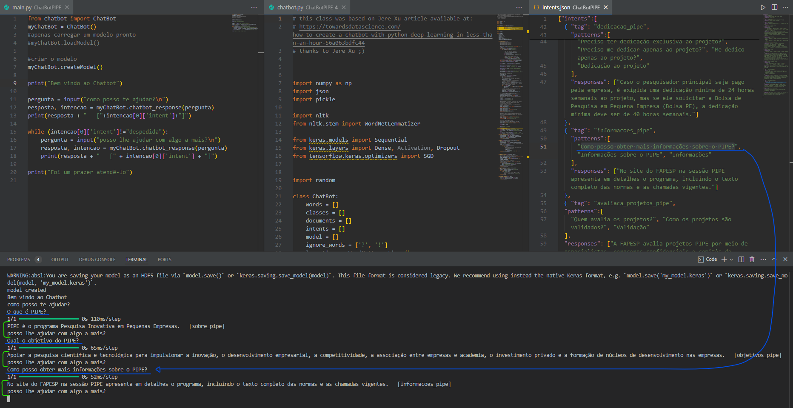

# Chatbot - PIPE

## Equipe:

Carlos Massato Horibe Chinen - 22.221.010-6

Vinicius Alves Pedro - 22.221.036-1

## Objetivo:

Desenvolver um chatbot que ajuda uma empresa e/ou um pesquisador a submeter um projeto PIPE (https://fapesp.br/pipe/) e auxiliar um usuário com suas dúvidas.

#### O relatório contem:

- Descrição das intenções **(em _desc_intents.md_)**
- Figura com o Dialogo proposto
- link para um vídeo de até 2 minutos mostrando o uso do chatbot com pelo menos três perguntas.

## Figura com estrutura e diálogo

## Vídeo de demonstração (YouTube):

