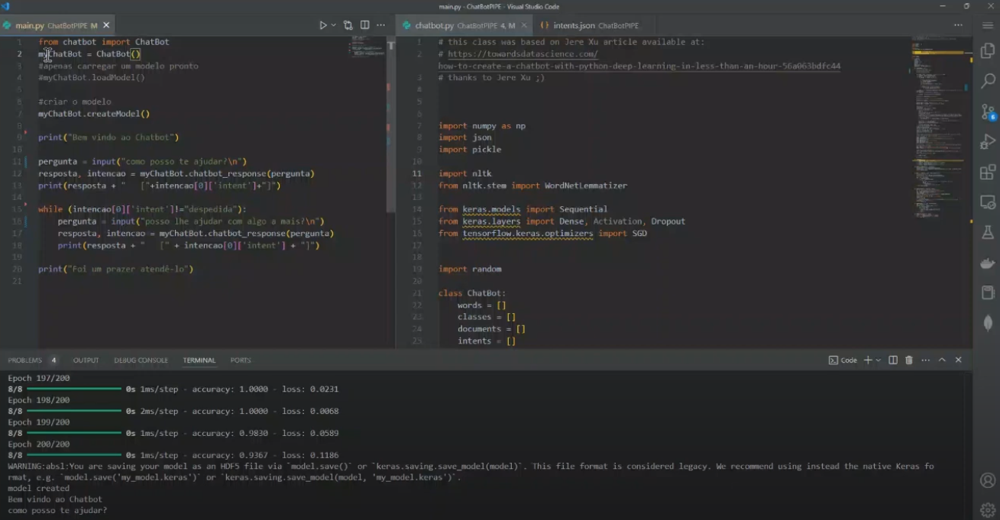

# Chatbot - PIPE

## Equipe:

Carlos Massato Horibe Chinen - 22.221.010-6

Vinicius Alves Pedro - xx.xxx.xxx-x

## Objetivo:

Desenvolver um chatbot que ajuda uma empresa e/ou um pesquisador a submeter um projeto PIPE (https://fapesp.br/pipe/) e auxiliar um usuário com suas dúvidas.

## Descrição das intenções

**tag: saudacao - saudação/cumprimento ao chatbot**

- patterns: Ola, Opa, Oi, tudo bem
- responses: Oi, Olá

**tag: despedida - encerramento do chatbot**

- patterns:valeu, tchau, Obrigado, tks
- responses: Até breve, Falou

**tag: data_prova - data de quanto será realizada a prova**

- patterns: Quando sera a prova?, A prova será em que dia?
- responses: no dia 26

**tag: sobre_pipe - o que é o PIPE e o que faz**

- patterns: O que é PIPE?, Me fale sobre o PIPE?, PIPE?, O que é PIPE, Me fale sobre o PIPE, PIPE, O que significa a sigla PIPE?
- responses: O PIPE-FAPESP apoia a execução de pesquisa científica e/ou tecnológica em micro, pequenas e médias empresas no Estado de São Paulo.

**tag: objetivos_pipe - principais objetivos do PIPE**

- patterns: Qual o objetivo do PIPE?, Quais são os objetivos do PIPE?, Qual o objetivo do PIPE, Quais são os objetivos do PIPE, Objetivos PIPE, Objetivos
- responses: Apoiar a pesquisa científica e tecnológica para impulsionar a inovação, o desenvolvimento empresarial, a competitividade, a associação entre empresas e academia, o investimento privado e a formação de núcleos de desenvolvimento nas empresas.

**tag: etapas_pipe - etapas/fases do PIPE e regras**

- patterns: Quais as etapas do PIPE?, Etapas do PIPE, Etapas
- responses: As quatro fases do Programa PIPE da FAPESP consistem em: verificação da viabilidade técnico-científica (Fase 1, até 9 meses e R$ 300.000), execução da pesquisa (Fase 2, até 24 meses e R$ 1.500.000), aceleração de projetos com interesse de terceiros (PIPE Invest, até 24 meses e R$ 1.500.000) e desenvolvimento comercial e industrial de inovações de pesquisas anteriores, sem apoio da FAPESP ou a partir de pesquisa do PIPE (Fase 3).

**tag: quando_proposta_pipe - quando pode se submeter uma proposta ao PIPE**

- patterns: Quando posso submeter uma proposta ao PIPE?, Proposta PIPE, Submeter proposta ao PIPE
- responses: As propostas para o PIPE Fase 1, Fase 2 e PIPE Invest são recebidas em fluxo contínuo durante todo o ano.

**tag: dedicacao_pipe - tempo de dedicação exclusiva ao projeto**

- patterns: Preciso ter dedicação exclusiva ao projeto?, Preciso me dedicar apenas ao projeto?, Me dedico apenas ao projeto?, Dedicação ao projeto
- responses: Caso o pesquisador principal seja pago pela empresa, é exigida uma dedicação mínima de 24 horas semanais ao projeto, mas se ele solicitar a Bolsa de Pesquisa em Pequena Empresa (Bolsa PE), a dedicação mínima deve ser de 40 horas semanais.

**tag: informacoes_pipe - onde encontrar mais informações sobre o PIPE**

- patterns: Como posso obter mais informações sobre o PIPE?, Informações sobre o PIPE, Informações
- responses: No site do FAPESP na sessão PIPE apresenta em detalhes o programa, incluindo o texto completo das normas e as chamadas vigentes.

**tag: avaliaca_projetos_pipe - grupo que avalia os projetos**

- patterns: Quem avalia os projetos?, Como os projetos são validados?, Validação
- responses: A FAPESP avalia projetos PIPE por meio de especialistas, pareceres confidenciais e comitês de avaliação, culminando em uma recomendação final à Diretoria Científica para a decisão.

## Link para vídeo de demonstração:

